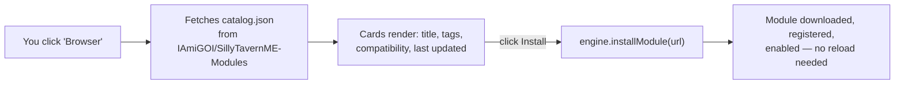
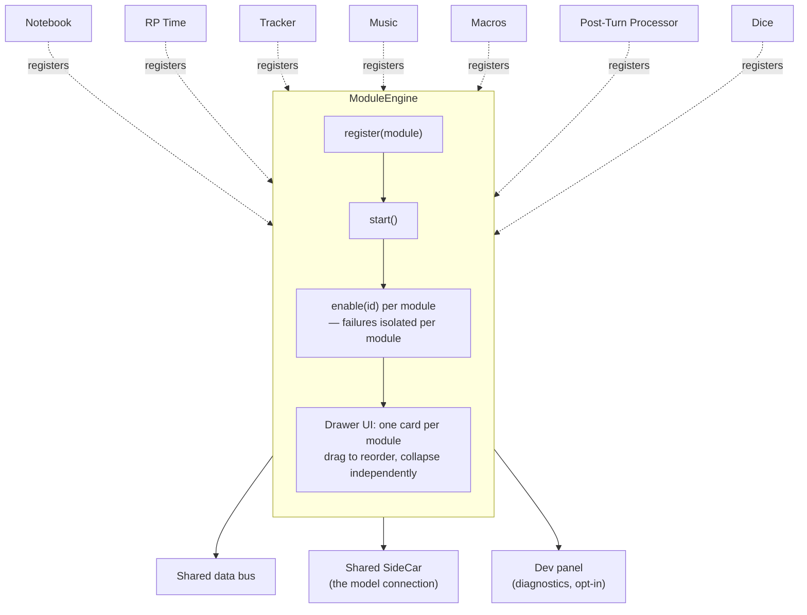
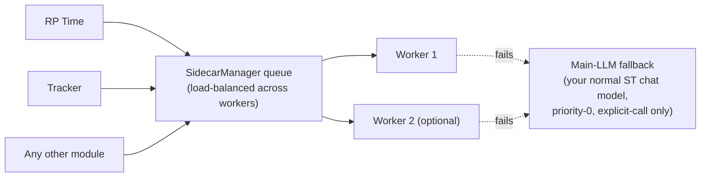
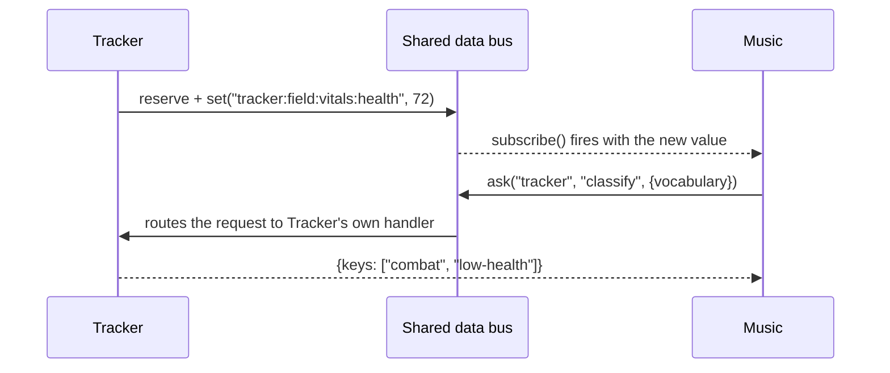

# ST Module Engine

A single SillyTavern extension that hosts a whole family of independent
features — a notebook, an in-world clock, stat trackers, a music player,
user-defined macros — under **one drawer, one settings screen, one shared
brain**. Install it once; enable only what you actually want.

> New here? Read this file top to bottom — it starts simple and gets
> progressively more technical. If you want to *build* a module yourself,
> the deep reference lives in [MODULES.md](MODULES.md).

---

## Table of contents

1. [What is this, really?](#what-is-this-really)
2. [Install it](#install-it)
3. [What's in the box](#whats-in-the-box)
4. [Get more modules: the Browser](#get-more-modules-the-browser)
5. [How it's put together](#how-its-put-together)
6. [The shared brain: SideCar](#the-shared-brain-sidecar)
7. [How modules talk to each other](#how-modules-talk-to-each-other)
8. [Staying up to date](#staying-up-to-date)
9. [Build your own module](#build-your-own-module)
10. [Share a module with everyone](#share-a-module-with-everyone)
11. [Project layout](#project-layout)

---

## What is this, really?

SillyTavern extensions normally come one at a time: one script, one settings
block bolted onto the extensions panel, one thing to break independently of
everything else. **ST Module Engine flips that around.** It's a small host
that other features plug into as *modules* — plain objects with a start
function and a UI renderer — and the host takes care of everything that's
normally copy-pasted boilerplate:

- one settings drawer instead of five
- one shared connection to an LLM ("SideCar") instead of every feature
  reinventing its own endpoint/key/model form
- a module that crashes on enable doesn't take the others down with it — you
  get a **Retry** button, not a broken extensions page
- modules can hand data to each other (a tracked stat, the in-world time, a
  macro value) through one small shared bus, instead of scraping each
  other's DOM or chat text

If you've ever installed three different ST extensions and had to configure
"which model do you want to use" three separate times, that's the specific
annoyance this exists to remove.

## Install it

In SillyTavern: **Extensions → Install extension**, paste the repository URL
(not a `tree/...` page, not a subfolder link — the plain clone URL):

```text
https://github.com/IAmiGOI/ST.git
```

Reload SillyTavern once it's installed. That's it — a new **ST Module
Engine** drawer appears in the Extensions panel, and a small icon is added
next to SillyTavern's own top-bar icons for the full-screen view (more on
that [below](#how-its-put-together)).

<!--
  Screenshot idea for whoever fills this in later: the collapsed drawer in
  Extensions, right after a fresh install, before anything is enabled.
-->

Everything below this point is enabling and configuring the parts you want —
nothing runs, requests a model, or does background work until you turn it on.

## What's in the box

Seven modules ship built in. Only **Notebook** is on by default; the rest are
opt-in because they either need a model configured first, register a new tool
for the character LLM, or are niche enough that most people don't want them
running unasked.

| Module | On by default? | What it does |
|---|---|---|
| **Notebook** | ✅ yes | Private working memory for the LLM — notes it can write and update mid-roleplay without them cluttering the visible chat. |
| **RP Time** | ⬜ no | Keeps an in-world clock. After every reply, asks your configured model for a short time label and appends it to the message. |
| **Tracker** | ⬜ no | Any number of stat blocks (health, mood, relationship meters, anything JSON-shaped) kept up to date automatically, each with its own model profile. |
| **Music** | ⬜ no | A local audio player that picks tracks by scene — tag your files with keys like `combat`/`tavern`/`night`, and it classifies each new scene and plays a fitting, non-repeating track. |
| **Macros** | ⬜ no | Define your own `{{macro}}` values — a fixed line of text, or a tiny sandboxed program that computes something from other modules' live data. |
| **Post-Turn Processor** | ⬜ no | Runs each fresh reply through a chain of independent rewrite passes (own instruction, own model profile, optional chat context per pass) and replaces the message with the final result — with a per-message toggle to see exactly what each pass changed. |
| **Dice** | ⬜ no | Rolls tabletop dice (presets, pools, or notation like `2d6`) from the UI or a function tool the character LLM can call — other modules can also push a quick roll into view or pull a roll on demand. |

Each one is a card in the drawer: a toggle, its own settings, and (for
Tracker and Music) an optional floating window you can drag around
independently of the SillyTavern window itself.

<!-- Screenshot idea: the Modules list with a couple of cards expanded. -->

Want the full detail on any of these — every setting, every field, every
edge case? See the matching section of [MODULES.md](MODULES.md); this file
stays at the "what and why" level on purpose.

## Get more modules: the Browser

Built-in modules aren't the whole story. A **Browser** tab sits right next
to Modules in the drawer — click it and a full-screen panel opens with
cards for every module in the community catalog: title, description, tags,
whether it's compatible with your current engine version, when it was last
updated, and a one-click install. Already-installed modules are marked as
such instead of offering another "install."



No forks, no accounts, no separate site to visit — the catalog is just a
JSON file in its own small repository, and browsing it happens entirely
inside the extension. The same panel also has a "Load from a link" field
for a module someone hasn't (yet) submitted to the catalog, and a form that
opens a ready-filled GitHub PR page if you want to propose your own module
for listing.

<!-- Screenshot idea: the Browser panel with a few module cards visible. -->

## How it's put together

At the top, `index.js` builds one `ModuleEngine` and registers every module
with it before starting. From there the engine owns each module's whole
lifecycle:



A few things fall out of that shape, and they're the actual reason this
exists rather than five separate extensions:

- **One module breaking doesn't break the rest.** Enabling a module is
  wrapped so a thrown error becomes a **Retry** button on that one card, not
  a broken settings page.
- **Two entry points, one UI.** The same drawer content also opens as a
  full-screen overlay from a top-bar icon — useful on narrower screens, or
  for anything with a lot to look at (like the Browser panel). Modules
  never need to know which one they're currently rendered inside.
- **A `⚙ ModuleEngine Developer` button** at the bottom of the drawer opens a
  floating diagnostic window — every module's state, every shared data
  channel and its live value, the engine's recent log. Nothing to set up:
  anything a module shares becomes visible here automatically.

## The shared brain: SideCar

Most of these modules need to ask a language model something small and
specific ("what time is it in-world now", "did health change this turn").
Rather than each module keeping its own endpoint/key/model form, there's
one shared connection — **SideCar** — configured once under **Base
settings**, and every module borrows it:



You can configure more than one worker (different endpoints, different
models) and the manager spreads requests across whichever is free. On top
of that, a **main-LLM fallback** exists as an explicit escape hatch: a
module that hits a real failure can ask to fall back to your own
main-chat connection instead of failing outright — it's zero-priority and
never part of the normal request rotation, only reachable when a module
deliberately asks for it. The SideCar Manager card's outer border blinks
blue whenever nothing is configured or reachable, so a broken setup is
visible without digging into logs.

Modules never see your API key — SideCar owns the connection and only ever
hands back the finished text.

A second, separate **Embedding SideCar** card sits right next to SideCar
Manager under Base settings — its own endpoint/model, no sampler or
reasoning fields, because embeddings are a different contract entirely
(text in, a fixed-length vector out, not chat completion). It isn't part
of the generation worker pool above and doesn't round-robin — one
connection is the norm, since every vector you produce has to stay
comparable against every other one. As of this writing it's pure
infrastructure (`host.embedding.request(text)`); no built-in module reads
from it yet.

## How modules talk to each other

Music picks tracks based on what Tracker thinks is happening in the scene.
RP Time's clock persists and survives a reload. Macros can compute a value
from three different modules' live state at once. None of that happens
through scraping the chat or another module's DOM — it goes through one
small, typed **data bus**:



Every value published this way can also become a real SillyTavern
`{{macro}}` automatically — so `{{tracker_vitals_health}}` works anywhere ST
itself does macro substitution: prompts, World Info, character cards, Quick
Replies, not just where this extension explicitly injects text.

This is intentionally the *only* sanctioned way one module reads another's
live state — there's no back-door "just read the other module's internal
object" path anywhere in this codebase, on purpose: it's what keeps modules
swappable and keeps a broken/missing module from silently breaking another.

The full API — schemas, persistence, services vs. plain channels, writing a
producer/consumer pair — is in MODULES.md's
[data bus section](MODULES.md#the-data-bus-exchanging-data-between-modules)
and [`host.services` section](MODULES.md#hostservices-services-modules-provide-to-each-other).

## Staying up to date

If this was installed via git (the normal install path above), the
extension checks for a newer version on every reload and updates itself
silently — no button to remember, no manual `git pull`. If the update
can't apply cleanly, a small banner appears with a **Retry**; everything
else about this is silent by design, so a working, up-to-date install never
shows you anything about it at all.

Individually loaded external modules (via the Browser's "Load from a link")
carry their own version, and get the same "check for updates" treatment
independently of the core engine.

## Build your own module

A module is a plain object. The minimum shape:

```js
export const myModule = {
  id: 'my-module',
  title: 'My Module',
  description: 'What it does, one line.',
  defaultEnabled: false,
  activate(host) {
    // set up — subscribe to events, reserve bus channels, etc.
    return () => { /* cleanup when disabled */ };
  },
  render(container, host) {
    // build this module's card UI, once per enable
  },
};
```

Register it before `engine.start()` and it gets a card exactly like the
five built-in modules — same error isolation, same shared SideCar access
via `host.sidecar`, same reordering, same everything. `host` also carries
`host.data` (the bus above) and `host.services` (request/response between
modules).

This is intentionally the five-minute version. The real guide —
lifecycle details, the UI framework, every `host` API, guardrails, worked
examples — is [MODULES.md](MODULES.md). Community discussion around "is
writing a module for this actually easier than a standalone ST extension"
landed on: yes, meaningfully, once you're past the one-time cost of
learning `host.data`/`host.services`.

## Share a module with everyone

Once your module works, publish it anywhere on GitHub (your own repo is
fine — no fork of this project needed) and either:

- paste the link into the Browser panel's **Load from a link** field
  yourself, or
- use the Browser panel's **Propose a module** form — it opens a
  ready-filled GitHub PR against the small catalog repo,
  [`IAmiGOI/SillyTavernME-Modules`](https://github.com/IAmiGOI/SillyTavernME-Modules).
  A maintainer reviews and lists it; your PR only ever touches your own
  module's code, never the catalog file itself.

Once listed, anyone browsing the catalog can install it in one click, and
it'll pick up its own future updates the same way built-in modules do.

## Project layout

```text
index.js                 entry point — builds the engine, registers built-in modules
manifest.json             SillyTavern extension manifest
core/
  module-engine.js         the host: lifecycle, settings, UI mounting
  data-bus.js               the shared bus modules exchange data through
  sidecar-manager.js        the shared model connection (workers + fallback)
  main-llm-service.js       the priority-0 "fall back to ST's own model" path
  module-browser.js         the Browser panel + community catalog UI
  module-catalog.js         fetching/parsing catalog.json
  module-loader.js          resolving a pasted GitHub link to a loadable file
  self-update.js            core self-update via ST's own git endpoints
  update-diagnostics.js     cross-checks self-update against GitHub directly
  dev-panel.js               the floating diagnostic window
  reactive.js / dom.js / widgets.js   the small UI framework modules build with
modules/
  notebook/  time/  tracker/  music/  macros/     the five built-in modules
tests/                     node --test unit tests (run with `npm test`)
MODULES.md                 the full module-author reference
```

---

Questions about a specific module's settings, or about writing your own,
belong in [MODULES.md](MODULES.md) — this file is the map, that one's the
territory.
